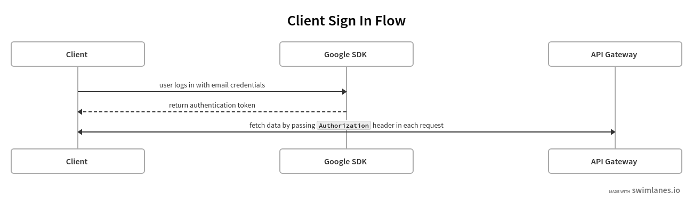
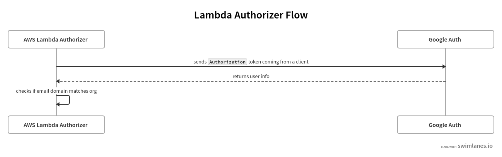
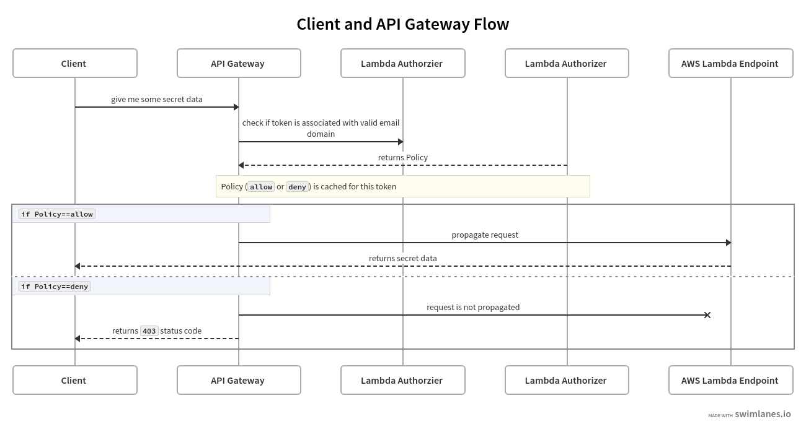
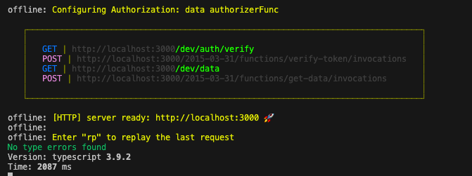

# Secure AWS Lambda with Google email domain check - Part 1

## Preface

We need to implement simple web application with couple of requirements:

- Application will have login and dashboard screens. After user succesfully logs in there is redirection to dashboard which will fetch some secret data using our endpoint

- REST endpoints will not be used very often so setting up `EC2` machine with server constantly running would be overkill (\$\$\$)

- Client can use our REST API only if user is authenticated with email matching `mycompany.com` domain

We will go with `AWS Lambda` bundled with custom [`authorizer`](https://docs.aws.amazon.com/apigateway/latest/developerguide/apigateway-use-lambda-authorizer.html) for validing token coming from login process. In addition we will use [`serverless`](http://serverless.com) for bundling and deployment. Our language choose will be [`Typescript`](http://typescriptlang.org) for both lambda and client.

## Architecture

We need to make sure that client will use Google sign in using email with preferred domain and then call our lambda function using `AWS API Gateway` passing `Authorization` header:


Before reaching to any secured data we will use custom authorizer which will check if token is associated with email matching our preferred domain:


Finally we can take a look at complete client and lambdas endpoints flow:


Ok, it should be _more or less_ clear, we can...

## Start coding!


We will implement two parts of a project - our BE and FE. We will use `Typescript` on both.
Let's start with our API so we won't block our FE team.

### Lambdas

We need three main parts on our serverless back end:

- Authorizer for email domain verification
- Secret data endpoint secured with authorizer
- Helper endpoint for validating if token is valid (so after logging in client can check if there is point in moving user to dashboard)

#### Authorizer

We will use [`google-auth-library`](https://www.npmjs.com/package/google-auth-library) for email domain verification, let's start by creating `verify` helper method:

```typescript
const client = new OAuth2Client(CLIENT_ID);
const acceptedDomains = [COMPANY_DOMAIN];

async function verify(token?: string) {
  if (!token) {
    throw Error("Missing auth token");
  }

  const ticket = await client.verifyIdToken({
    idToken: token,
    audience: CLIENT_ID,
  });
  const payload = ticket.getPayload();
  if (!payload || !payload.hd) {
    throw Error("Missing payload");
  }

  if (acceptedDomains.includes(payload.hd)) {
    return true;
  } else {
    throw Error("Invalid Google Domain");
  }
}
```

You might notice we are passing `CLIENT_ID` for our `OAuth2Client`.  
In order to create it you need to log to [developer console](http://developers.google.com) and click through those steps:

1. Credentials
2. Create Credentials
3. OAuth client ID ((might ask you to setup application name first))
4. Select **Web application**
5. Put name of your key
6. Set authorized origins for debugging purposes (e.g. `http://localhost:3000`)

We will pass both `CLIENT_ID` and `COMPANY_DOMAIN` via env variable.

You are probably asking yourself what is that weird `payload.hd` line.

`hd` stands for **hosted domain** and it is string containing email domain. Once we get it we simply check if it matches our requirements. In any other case we are throwing an `Error`.

Once we have our `verify` function we can add `authorizer` and `verifyToken` endpoint:

```typescript
export const authorizationHandler = async (
  event: APIGatewayTokenAuthorizerEvent,
  _
) => {
  try {
    await verify(event.authorizationToken);
    return generateAllow("*");
  } catch (exception) {
    console.error(exception, exception.stack);
    return generateDeny(event.methodArn);
  }
};

export const verifyTokenHandler = async (
  event: APIGatewayProxyEvent
): Promise<APIGatewayProxyResult> => {
  const headers = event.headers || {};
  try {
    await verify(headers["Authorization"]);
    return {
      statusCode: 200,
      body: "Success",
    };
  } catch (exception) {
    return {
      statusCode: 403,
      body: "Failure",
    };
  }
};
```

`authorizationHandler` generates `allow` policy for all (thus `"*"`) resources, because of the way `AWS` caches policy response (based on `Authorization` header). If we used `event.methodArn` client would be able to execute only on response while getting `403` for all further ones (because of `arn` mismatch). We could generate something more strict here, but for now let's keep it simple.

`verifyTokenHandler` returns `statusCode` according to sent token:

- `200` if it is valid (domain matches our organization/company)
- `403` if it is invalid

#### Secured endpoint

Finally, we can implement our dummy _secret data_ endpoint:

```typescript
const secretData = ["Super Secret String 1", "Super Secret String 2"];

export const getData = async (
  event: APIGatewayEvent
): Promise<APIGatewayProxyResult> => {
  return {
    statusCode: 200,
    body: JSON.stringify(secretData),
  };
};
```

### Putting all together

Now we can add our lambdas declarations to `serverless.yml` file:

```yaml
functions:
  authorizerFunc:
    handler: src/auth/controller.authorizationHandler

  verify-token:
    handler: src/auth/controller.verifyTokenHandler
    events:
      - http:
          path: auth/verify
          method: get
          cors: true

  get-data:
    handler: src/data/controller.getData
    events:
      - http:
          path: data
          method: get
          cors: true
          authorizer: authorizerFunc
```

We expose two endpoints:

- `GET /data` which points to `getData` handler, secured by our custom authorizer
- `GET /auth/verify` which points to `verifyTokenHandler`

Let's run our lambdas locally:

```bash
serverless offline
```

You should see them running on `localhost`:


Calling `/dev/data` should throw `403` status error because of missing authorization header:

```bash
$ curl http://localhost:3000/dev/data
{"statusCode":403,"error":"Forbidden","message":"User is not authorized to access this resource"}
```

Huh, that was pretty easy, right?  


We could start playing with our endpoints, but let's do that by implementing front end part. This is [part 2 ouf our article](article-part-2.md).
