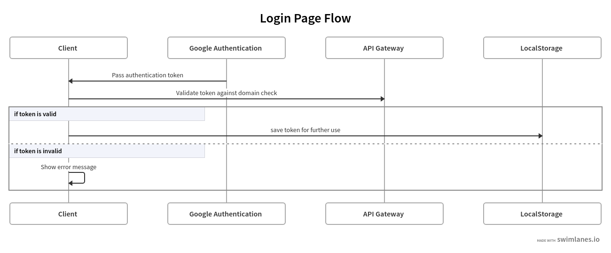

# Secure AWS Lambda with Google email domain check - Part 2

## Preface

In [last part](article-part-1.md) we implemented our serverless back end using AWS Lambda + Google email authentication. Now, we are going to move to front end part. Our tech stack will be `React` + `Typescript`, which is perfect combo.


## Getting user credentials

We need to do couple of things on login page:



1. Display Google sign in button
2. Take token returned from Google authentication
3. Validate token against our `/verify` endpoint
4. If it's valid move user to dashboard page and fetch our secured data

We can achieve points #1 and #2 by using [react-google-login](https://github.com/anthonyjgrove/react-google-login) library:

```typescript
<main>
  <h1>Sign In to our realm</h1>
  <GoogleLogin
    clientId={process.env.REACT_APP_GOOGLE_CLIENT_ID!}
    onSuccess={signIn}
  />
</main>
```

We will pass the same OAuth client id we used while setting lambdas endpoints.

Now we can move for implementing our `signIn` callback:

```typescript
const verifyToken = async (token: string) => {
  const res = await fetch(`${baseUrl}/auth/verify`, {
    headers: { [AUTH_HEADER_NAME]: token },
  });
  return res.ok;
};

const signIn = useCallback(async ({ tokenId }) => {
  const isValidToken = await verifyToken(tokenId);
  if (!isValidToken) {
    setError("Invalid token.");
    return;
  }
  saveAuthToken(tokenId);
  history.replace("/");
});
```

`verifyToken` simply checks if token is valid or not based on HTTP status code. If it's invalid we display an error. If it's valid we redirect user to dashboard. We could skip validation part and simply try to hit our secured endpoint but it would complicate code little bit.  
In addition we are saving our token in [`LocalStorage`](https://developer.mozilla.org/pl/docs/Web/API/Window/localStorage) so whenever we refresh browser user does not have to login again:

```typescript
export const saveAuthToken = (token: string) => {
  localStorage.setItem(AUTH_TOKEN_KEY, token);
};
```

## Crossing the Rubicon

Finally, we can get access to our **secrets**!


We will do simple fetch by passing token as a `Authorization` header:

```typescript
const defaultHeaders = () => {
  const authKey = localStorage.getItem(AUTH_TOKEN_KEY);
  if (authKey) {
    return { [AUTH_HEADER_NAME]: authKey };
  }
};

export const getSecretData = async () => {
  const res = await fetch(`${baseUrl}/data`, {
    headers: defaultHeaders(),
  });
  if (res.ok) {
    return res.json();
  } else {
    throw Error("Failed to fetch secret data");
  }
};
```

Last thing left is to show it on our dashboard page:

```typescript
const [data, setData] = useState<string[]>();
useEffect(() => {
  const fetchSecrets = async () => {
    const mySecretTexts = await getSecretData();
    setData(mySecretTexts);
  };
  fetchSecrets();
}, []);

return (
  <main>
    <h1>Hello from dashboard</h1>
    {data && (
      <ul>
        {data.map((text) => (
          <li key={text}>{text}</li>
        ))}
      </ul>
    )}
  </main>
);
```

This is it!.  
We implemented happy path for our authentication flow, now we would have to think about some other edge cases:

- What if user tries to open `/login` page if it's already logged in?
- What if user tries to open `/dashboard` without sign in?
- What if user opens website after week of inactivity and saved token is invalid?

Let's worry about number #1 and #2.  
We gonna wrap our `Dashboard` and `Login` components with [`Route`](https://reacttraining.com/react-router/web/api/Route) allowing user to visit page only if it has correct authentication state.  
We are going to add `AuthState` enum covering all possible cases:

```typescript
export enum AuthState {
  LOADING = "loading",
  AUTHENTICATION_SUCCESS = "auth_success",
  AUTHENTICATION_FAILED = "auth_failed",
  NO_PREVIOUS_SIGN_IN = "auth_fresh",
}
```

Both `AUTHENTICATION_FAILED` and `NO_PREVIOUS_SIGN_IN` should redirect user to login page, while first one indicates that there was `authToken` saved in `LocalStorage`, although it did not pass validation test (e.g. is outdated).

Now we can use our `Route`-wrapper which will simply take predicate function and allow user to visit a page or redirect in case function returns false:

```typescript
type AuthRouteProps = {
  authPredicate: () => boolean;
  redirectPath: string;
  children: React.ReactNode;
};

const AuthenticatedRoute = ({
  authPredicate,
  redirectPath,
  children,
  ...rest
}: AuthRouteProps & RouteProps) => {
  return (
    <Route
      {...rest}
      render={({ location }) => {
        return authPredicate() ? (
          children
        ) : (
          <Redirect
            to={{
              pathname: redirectPath,
              state: { from: location },
            }}
          />
        );
      }}
    />
  );
};
```

Lastly we have to wrapper our components with matching predicate functions and redirect paths (we skipped `useCallback` definitions for simplicity):

```typescript
const isAuthenticated = () => {
  return authState === AuthState.AUTHENTICATION_SUCCESS;
};

const isUnauthenticated = () => {
  return [
    AuthState.AUTHENTICATION_FAILED,
    AuthState.NO_PREVIOUS_SIGN_IN,
  ].includes(authState);
};

<Switch>
  <AuthenticatedRoute
    authPredicate={isUnauthenticated}
    path="/login"
    redirectPath="/"
  >
    <Login />
  </AuthenticatedRoute>

  <AuthenticatedRoute  
    authPredicate={isAuthenticated}  
    redirectPath="/login">
    <Dashboard />
  </AuthenticatedRoute>
</Switch>;
```

We should also take care of actually setting correct `authState` in two cases:

- While app is booting we should validate token saved in `LocalStorage`
- If user logs in using our page we should set it to `AUTHENTICATION_SUCCESS`

App boot seems to be perfect use-case for `useEffect` hook:

```typescript
useEffect(() => {
  const appBoot = async () => {
    const authToken = getAuthToken();
    if (!authToken) {
      setBootState(AuthState.NO_PREVIOUS_SIGN_IN);
      return;
    }
    try {
      const isValidToken = await verifyToken(authToken);
      if (isValidToken) {
        setBootState(AuthState.AUTHENTICATION_SUCCESS);
      } else {
        throw new Error("Invalid auth token");
      }
    } catch (exception) {
      setBootState(AuthState.AUTHENTICATION_FAILED);
      removeAuthToken();
    }
  };

  appBoot();
}, []);
```

We also need to add callback to our `Login` page:

```typescript
<Login onSuccess={() => {
    setAuthState(AuthState.AUTHENTICATION_SUCCESS);
    history.replace("/");
}/>
```

Nice. Try to log in and then open `/login` path again. You should be redirected back to our dashboard. Similarly, if you open `/dashboard` you are asked to log in. In case of old `authToken` being stored in `LocalStorage` app will reach `AUTHENTICATION_FAILED` and sign in process would be repeated. 

We are ready to deploy and get some :clap: from your coworkers.


## Summary

We created pretty simple solution for secured `AWS Lambda + API Gateway` endpoint. It's easy to deploy and valid approach for internal tools which should be accessible for employees / members only. Creating front end can be really quick with help of 3rd party libraries such as `react-google-login` or `react-router`.
Source code is publicly available at my [github repo](https://github.com/pzmudzinski/lambda-google-sign-in).
